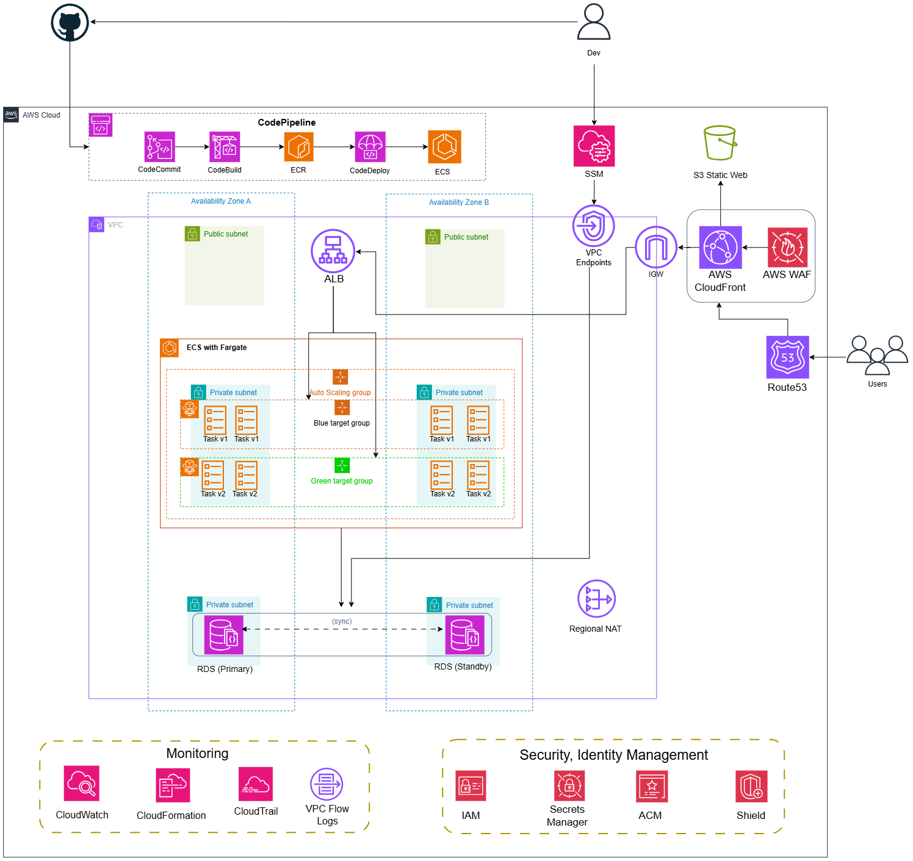

# DevOps on AWS

A production-ready book management CRUD app with **Django REST** backend and **React/Vite** frontend. Deployed on AWS with automated CI/CD, blue/green deployments, and enterprise-grade infrastructure.

---

## Architecture



### Architecture Overview

The application is deployed on AWS with a modern, scalable architecture:

- **Frontend:** CloudFront (CDN) → Private S3 bucket via Origin Access Control (OAC)
- **Backend API:** Application Load Balancer (ALB) → ECS Fargate → Django application
- **Database:** RDS Multi-AZ PostgreSQL with automated backups
- **CI/CD:** GitHub → CodePipeline → CodeBuild → CodeDeploy (blue/green deployments)
- **Security:** WAF on CloudFront, security groups, VPC with private/public subnets
- **Networking:** VPC with NAT Gateway, S3 VPC endpoint for cost optimization

---

## Tech Stack

### Backend
- **Framework:** Django 4+ (Python)
- **API:** Django REST Framework
- **Database:** PostgreSQL (Multi-AZ)
- **Container:** Docker + ECR
- **Deployment:** ECS Fargate

### Frontend
- **Framework:** React 18+
- **Build Tool:** Vite
- **Styling:** CSS
- **Hosting:** CloudFront + S3 (OAC)

### Infrastructure
- **IaC:** AWS CloudFormation (modular templates)
- **Compute:** ECS Fargate (no server management)
- **Load Balancing:** Application Load Balancer (ALB)
- **CDN:** CloudFront with Origin Access Control
- **Security:** AWS WAF, Security Groups
- **CI/CD:** CodePipeline + CodeBuild + CodeDeploy
- **Secrets:** AWS Secrets Manager
- **Monitoring:** CloudWatch Logs

### Cloud Services
- **VPC** with NAT Gateway for private subnet internet access
- **S3 VPC Endpoint** for efficient S3 access from private subnets
- **Route53** for DNS management
- **ACM** for SSL/TLS certificates

---

## Deployment

### CloudFormation Stacks (Modular)

The infrastructure is organized into 9 independent, reusable stacks:

1. **01-network.yaml** — VPC, subnets, NAT Gateway, S3 VPC Endpoint
2. **02-security.yaml** — Regional Security Groups
3. **03-database.yaml** — RDS Multi-AZ PostgreSQL
4. **07-certificates.yaml** — Regional ACM certificate for the ALB
5. **04-backend.yaml** — ECR, ECS, ALB, CodePipeline, CodeBuild, CodeDeploy
6. **05-frontend.yaml** — S3 bucket, CloudFront distribution, OAC
7. **06-dns.yaml** — Route53 A records (apex + API subdomain)
8. **08-observability.yaml** — CloudWatch, CloudTrail, VPC Flow Logs, SNS alerts
9. **09-global.yaml** — CloudFront ACM certificate and WAF in `us-east-1`

**Deployment guides:**
- [DEPLOYMENT_ORDER.md](./DEPLOYMENT_ORDER.md) — CLI-based deployment with AWS CLI
- [CLOUDFORMATION_CONSOLE_GUIDE.md](./CLOUDFORMATION_CONSOLE_GUIDE.md) — Step-by-step CloudFormation Console instructions

---

## Local Development

### Quick Start

```bash
# Backend
cd backend
uv run python manage.py runserver    # http://localhost:8000

# Frontend (new terminal)
cd frontend
npm install
npm run dev                          # http://localhost:5173
```

### API Endpoints

| Method | Endpoint           | Action      |
|--------|-------------------|-------------|
| GET    | `/api/books/`     | List all    |
| POST   | `/api/books/`     | Create      |
| GET    | `/api/books/<id>/`| Read        |
| PUT    | `/api/books/<id>/`| Update      |
| DELETE | `/api/books/<id>/`| Delete      |

---

## Environment Variables

### Backend (Django)
- `DJANGO_SECRET_KEY` — Secret key for Django (stored in Secrets Manager)
- `DJANGO_DEBUG` — Debug mode (false in production)
- `DJANGO_ALLOWED_HOSTS` — Allowed domains
- `DB_HOST` — RDS endpoint
- `DB_PORT` — Database port (5432)
- `DB_NAME` — Database name (book_manager)
- `DB_USER` — Database username (stored in Secrets Manager)
- `DB_PASSWORD` — Database password (stored in Secrets Manager)
- `CORS_ALLOWED_ORIGINS` — Frontend origins for CORS

### Infrastructure
- Parameter files: `cloudformation/parameters/{environment}-{stack}.json`

---

## Project Structure

```
fcaj-lab/
├── backend/
│   ├── books/               # Django app (API views, serializers)
│   ├── config/              # Django settings, URLs
│   ├── manage.py            # Django management
│   ├── Dockerfile           # Container image
│   ├── pyproject.toml       # Python dependencies
│   └── middleware.py        # CORS, cache control
├── frontend/
│   ├── src/                 # React components
│   ├── index.html           # HTML entry point
│   ├── package.json         # NPM dependencies
│   └── vite.config.js       # Vite configuration
├── architecture/            # Architecture notes and diagrams
│   └── README.md
├── cloudformation/          # Infrastructure as Code
│   ├── templates/            # One template per infrastructure layer
│   ├── parameters/           # One parameter file per environment and stack
│   └── scripts/              # Deployment helpers
├── buildspec.yml            # CodeBuild build specification
├── docker-compose.yml       # Local development setup
├── init.sql                 # Database initialization script
├── DEPLOYMENT_ORDER.md      # CLI deployment guide
└── CLOUDFORMATION_CONSOLE_GUIDE.md  # Console deployment guide
```

---

## Key Features

✅ **Modular Infrastructure** — Separate CloudFormation stacks for each layer  
✅ **Multi-AZ Database** — Automated failover and backups  
✅ **Blue/Green Deployments** — Zero-downtime updates via CodeDeploy  
✅ **Security Groups & WAF** — Network security at multiple layers  
✅ **Private S3 Bucket** — Frontend served via CloudFront OAC  
✅ **CI/CD Pipeline** — Automated builds and deployments from GitHub  
✅ **Secrets Management** — Sensitive values in AWS Secrets Manager  
✅ **VPC Optimization** — S3 VPC endpoint reduces NAT charges  
✅ **Auto-scaling** — ECS service auto-scales based on CPU utilization  
